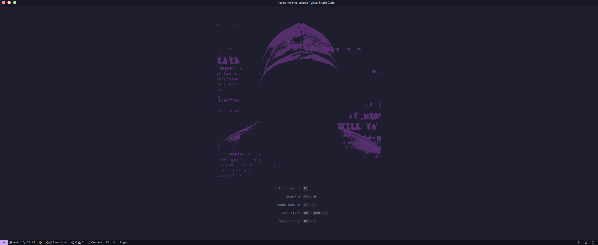
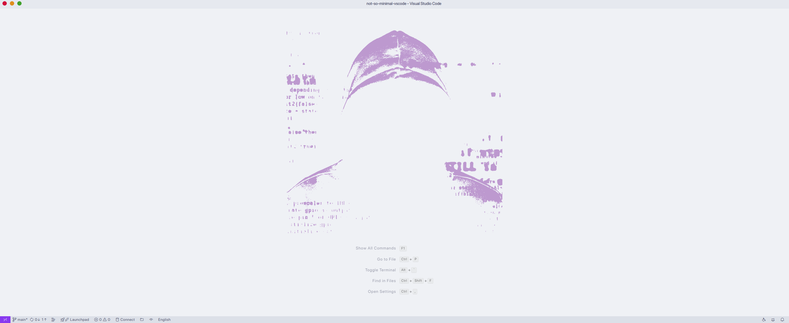
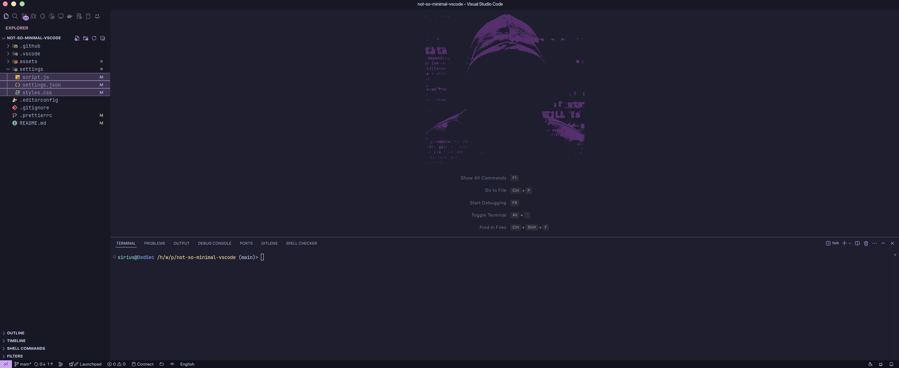
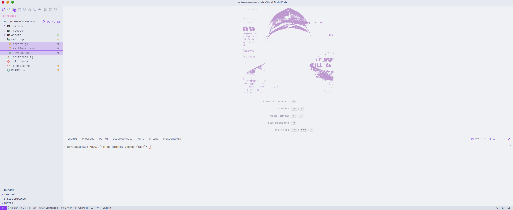
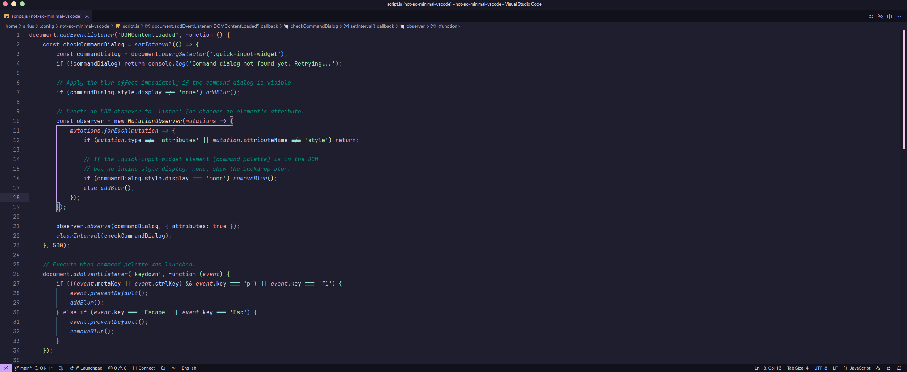
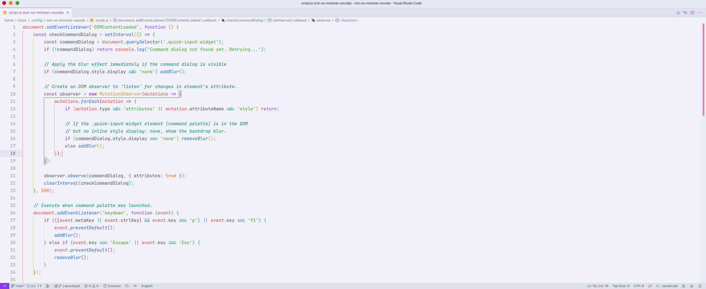
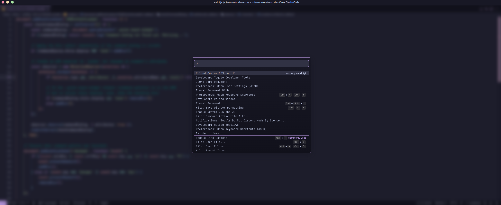
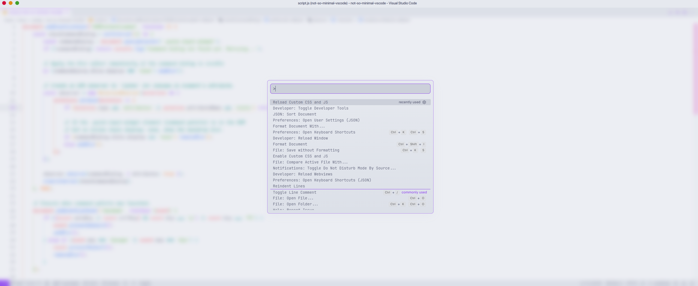

# Not So Minimal - VS Code

A not so minimal VS Code UI modification with automatic support for light and dark modes.

<br />

> [!NOTE]
> Read the [Custom CSS and JS Loader documentation](https://marketplace.visualstudio.com/items?itemName=be5invis.vscode-custom-css) for tips on avoiding issues with changes not taking effect.

<br />

- [Preview](#preview)
- [Requirements](#requirements)
- [Installation](#installation)
- [Extra Steps](#extra-steps)

## Preview

|                                                      Dark                                                       |                                                       Light                                                       |
| :-------------------------------------------------------------------------------------------------------------: | :---------------------------------------------------------------------------------------------------------------: |
|                                                      |                                                      |
|  |  |
|                                                        |                                                        |
|                                      |                                      |

## Requirements

### Font

If you decide to use one of the fonts listed below, no changes are necessary. Otherwise, follow [***these steps***](#using-another-font).

- [JetBrainsMono Nerd Font](https://www.nerdfonts.com/font-downloads)
- [JetBrains Mono](https://www.jetbrains.com/lp/mono/)
- [Fira Code Nerd Font](https://www.nerdfonts.com/font-downloads)
- [Fira Code](https://github.com/tonsky/FiraCode)

### Extensions

Press `Ctrl + P` (Windows/Linux) or `Cmd + P` (Mac), enter, and execute the following commands:

> [!NOTE]
> For extensions that are not required, feel free if you want to install alternatives

| Name                     | Command                                            |                                                                    |
| ------------------------ | -------------------------------------------------- | ------------------------------------------------------------------ |
| Custom CSS and JS Loader | `ext install be5invis.vscode-custom-css`           |        |
| Catppuccin for VS Code   | `ext install Catppuccin.catppuccin-vsc`            |  |
| Fluent Icons             | `ext install miguelsolorio.fluent-icons`           |        |
| Gruvbox Material Icons   | `ext install navernoedenis.gruvbox-material-icons` |        |

| Icon                                                               | Tag                                              | Description                                                         |
| ------------------------------------------------------------------ | ------------------------------------------------ | ------------------------------------------------------------------- |
|        | <span style="color: #f85149;">Required</span>    | The mod will not work without it.                                   |
|  | <span style="color: #3fb950;">Recommended</span> | Improves visual consistency, but is not mandatory.                  |
|        | <span style="color: #f8ec44;">Optional</span>    | Does not prevent the mod from working, but improves the experience. |

## Installation

### 1. Clone the Repository

#### Linux and Mac

```shell
git clone https://github.com/sirius-red/not-so-minimal-vscode.git /tmp/not-so-minimal-vscode
cp -rf "/tmp/not-so-minimal-vscode/settings" ~/.config/not-so-minimal-vscode
rm -rf "/tmp/not-so-minimal-vscode"
```

#### Windows

```powershell
git clone https://github.com/sirius-red/not-so-minimal-vscode.git $env:TEMP\not-so-minimal-vscode
Copy-Item -Path $env:TEMP\not-so-minimal-vscode\settings -Destination $env:USERPROFILE\.config\not-so-minimal-vscode -Recurse -Force
Remove-Item -Path $env:TEMP\not-so-minimal-vscode -Recurse -Force
```

### 2. Apply the VS Code Settings

Copy the contents of `~/.config/not-so-minimal-vscode/settings.json` into your VS Code configuration file. Remove duplicate options if necessary.

### 3. Enable Custom CSS and JS Loader

Open the **Command Palette** (`Ctrl + Shift + P`), enter, and execute:

```txt
Enable Custom CSS and JS Loader
```

If Visual Studio Code cannot modify itself, follow [these steps](#linux-and-mac-permissions).

## Extra Steps

### Using another font

1. Install the source of your choice. (Installation may vary according to your operating system).
2. Change the source name in the `editor.fontFamily` properties, `editor.inlayHints.fontFamily` and `editor.inlineSuggest.fontFamily` in VS code configurations.
3. Change the source name in the variable `--nsmvsc-font-mono` in the file `~/.config/not-minimal-vscode/style.css`.
4. Reload the extension after making changes (Or [enable](#3-enable-custom-css-and-js-loader) if it is not yet enabled):
   1. Open the **Command Palette** (`Ctrl + Shift + P`).
   2. Enter and execute:

      ```txt
      Reload Custom CSS and JS
      ```

### Linux and Mac Permissions

#### Common Issues

- Read-only VS Code files.
- Running VS Code without necessary permissions.

#### Fix

1. Close VS Code and run one of the following commands to claim ownership of the installation directory:

    ```sh
    sudo chown -R $(whoami) "$(which code)"
    ```

    ```sh
    sudo chown -R $(whoami) /opt/visual-studio-code
    ```

    > [!TIP]
    > For the second command, replace `/opt/visual-studio-code` with the correct path for your system:
    >
    > - **Arch Linux:** `/usr/lib/code/` or `/opt/visual-studio-code`
    > - **Most Linux distros:** `/usr/share/code`
    > - **MacOS:** `/Applications/Visual Studio Code.app/Contents/MacOS/Electron`
    > - **MacOS (Insiders):** `/Applications/Visual Studio Code - Insiders.app/Contents/MacOS/Electron`

2. Open VS Code and [Enable Custom CSS and JS Loader](#3-enable-custom-css-and-js-loader).

### Customizing

1. Modify `~/.config/not-so-minimal-vscode/styles.css` or `~/.config/not-so-minimal-vscode/script.js` to fit your preferences.
2. Reload the extension after making changes (Or [enable](#3-enable-custom-css-and-js-loader) if it is not yet enabled):
   1. Open the **Command Palette** (`Ctrl + Shift + P`).
   2. Enter and execute:

      ```txt
      Reload Custom CSS and JS
      ```
